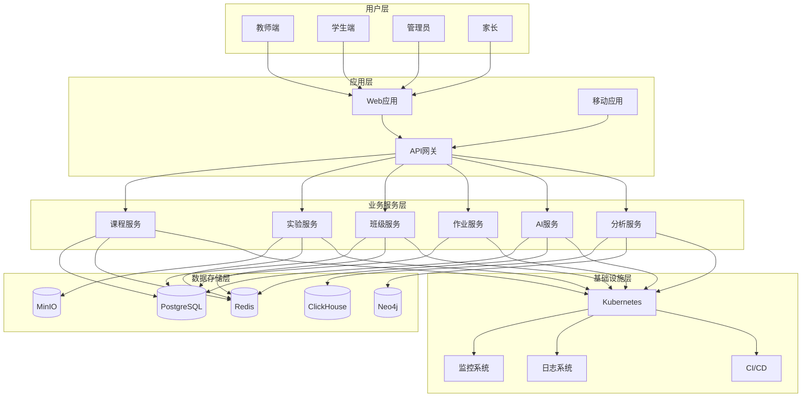

# 架构设计文档

## 文档版本说明

本文档目录包含智能教育基础设施的完整架构设计，与代码实现保持同步版本。

### 文档清单

| 文档 | 版本 | 描述 | 更新日期 |
|------|------|------|----------|
| [项目架构重新梳理](./项目架构重新梳理.md) | v1.0.0 | 整体项目需求和架构梳理 | 2024-01-15 |
| [技术架构详细设计](./技术架构详细设计.md) | v1.0.0 | 前后端技术架构详细设计 | 2024-01-15 |
| [接口契约与系统架构](./接口契约与系统架构.md) | v1.0.0 | API接口、数据库拓扑、部署架构 | 2024-01-15 |
| [实施路线图与执行策略](./实施路线图与执行策略.md) | v1.0.0 | 项目实施计划和风险控制 | 2024-01-15 |

## 架构概览

### 核心设计原则

1. **教育优先**: 技术选择服务于教学目标，基于认知科学和学习理论
2. **企业级架构**: 支持多租户、微服务、渐进式演进
3. **AI原生**: AI能力深度集成，而非插件式添加
4. **开放生态**: 支持第三方扩展和内容共享

### 技术栈选择

- **前端**: Vue 3 + TypeScript + Element Plus (深度定制)
- **后端**: Node.js + NestJS (渐进式微服务演进)
- **数据库**: PostgreSQL + Redis + ClickHouse + Neo4j + MinIO
- **AI**: 多模型支持 (OpenAI + Claude + 本地模型)
- **部署**: Docker + Kubernetes + GitOps

### 系统架构图



## .acl 核心创新

### AiCourseLayout 格式

.acl (AiCourseLayout) 是本项目的核心创新，将教学经验工程化：

```json
{
  "meta": {
    "id": "course-uuid",
    "version": "1.2.0",
    "tags": ["物理", "光学", "八年级"]
  },
  "courseInfo": {
    "learningObjectives": [
      {
        "cognitiveLevel": "应用",
        "assessmentCriteria": ["能解释折射现象", "能计算折射角度"]
      }
    ],
    "aiPrompts": {
      "generation": "基于认知负荷理论设计探索性学习活动",
      "assessment": "评估学生对折射概念的理解深度"
    }
  },
  "structure": [
    {
      "type": "engagement",
      "aiStrategy": {
        "type": "personalizedHook",
        "dataSources": ["studentInterests", "realWorldApplications"]
      }
    }
  ]
}
```

### 价值主张

1. **教学知识结构化**: 将模糊的教学经验转化为可计算的格式
2. **AI深度集成**: AI不是装饰，而是教学法的数字化体现
3. **版本控制**: 支持课程内容的迭代和协作
4. **标准化**: 教育内容的标准协议，支持生态共建

## 实施策略

### 四阶段实施计划

1. **基础设施验证 (0-3个月)**: 验证.acl格式和核心架构
2. **AI能力集成 (4-6个月)**: AI辅助教学全流程
3. **生态化建设 (7-12个月)**: 内容市场和协作平台
4. **规模化与开放 (12个月+)**: 多校区部署和第三方生态

### 风险控制

- **技术风险**: 分阶段验证，避免过度工程化
- **业务风险**: 教师早期参与，确保价值创造
- **安全风险**: 零信任架构，数据保护优先

## 技术亮点

### 1. AI服务的企业级架构

```typescript
// 多模型网关 + Prompt管理 + 内容安全
class AIModelGateway {
  async generateResponse(request: AIRequest): Promise<AIResponse> {
    const selectedModel = await this.selectOptimalModel(request)
    const prompt = await this.promptManager.renderTemplate(request)
    const response = await this.executeWithModel(selectedModel, prompt)
    return await this.validateAndPostProcess(response, request)
  }
}
```

### 2. 虚拟实验环境

```typescript
// 安全的容器化实验环境
class VirtualLabManager {
  async createEnvironment(studentId: string, config: ExperimentConfig) {
    const container = await this.createSecureContainer({
      studentId,
      resources: this.calculateResources(config),
      security: 'educational'
    })
    return { containerId: container.id, aiAssistant: await this.setupAIAssistant() }
  }
}
```

### 3. 学习分析引擎

```typescript
// 多维度学习分析
class LearningAnalyticsEngine {
  async buildStudentProfile(studentId: string): Promise<StudentProfile> {
    const knowledgeMastery = await this.analyzeKnowledgeMastery(studentId)
    const behaviorPatterns = await this.analyzeBehaviorPatterns(studentId)
    const recommendations = await this.generatePersonalizedRecommendations(
      knowledgeMastery, behaviorPatterns
    )
    return { knowledgeMastery, behaviorPatterns, recommendations }
  }
}
```

## 贡献指南

### 文档维护

- 所有架构变更必须同步更新文档
- 文档版本与实现版本保持一致
- 重大变更需要架构评审

### 设计原则

1. **可读性优先**: 架构文档应该清晰易懂
2. **实用导向**: 解决实际问题，避免过度设计
3. **持续迭代**: 随着项目发展不断优化架构

---

**注意**: 本文档与代码实现保持同步，如有疑问请参考具体实现或联系架构团队。