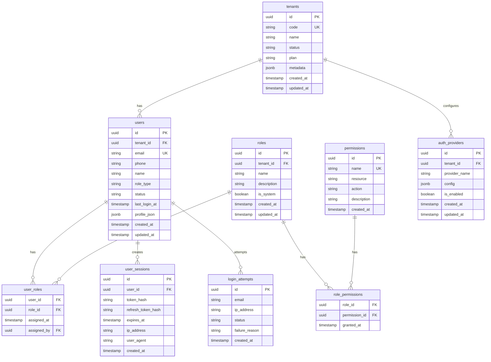

# 数据库 Schema 设计

## 核心实体关系图 (ERD)



## JSON Schema 定义

### 用户 Profile Schema
```json
{
  "$schema": "http://json-schema.org/draft-07/schema#",
  "type": "object",
  "properties": {
    "avatar": {
      "type": "string",
      "format": "uri"
    },
    "timezone": {
      "type": "string",
      "default": "Asia/Shanghai"
    },
    "language": {
      "type": "string",
      "default": "zh-CN"
    },
    "notifications": {
      "type": "object",
      "properties": {
        "email": {"type": "boolean", "default": true},
        "push": {"type": "boolean", "default": true},
        "sms": {"type": "boolean", "default": false}
      }
    },
    "preferences": {
      "type": "object",
      "properties": {
        "theme": {"type": "string", "enum": ["light", "dark", "auto"], "default": "auto"},
        "workspace_layout": {"type": "string", "default": "default"}
      }
    }
  }
}
```

## Labs & Virtual Lab Agent ERD


### Lab Device Policy Schema
```json
{
  "$schema": "http://json-schema.org/draft-07/schema#",
  "type": "object",
  "properties": {
    "grade_band": {"type": "string", "enum": ["primary","middle","high"]},
    "quota_cpu": {"type": "number", "minimum": 0.1},
    "quota_memory": {"type": "number", "minimum": 0.5},
    "allowed_packages": {
      "type": "array",
      "items": {"type": "string"}
    },
    "auto_start": {"type": "boolean", "default": true},
    "jupyter_port": {"type": "integer", "minimum": 1024, "maximum": 65535},
    "heartbeat_interval_sec": {"type": "integer", "minimum": 3, "default": 5}
  },
  "required": ["grade_band", "quota_cpu", "quota_memory", "auto_start"]
}
```

### 租户配置 Schema
```json
{
  "$schema": "http://json-schema.org/draft-07/schema#",
  "type": "object",
  "properties": {
    "branding": {
      "type": "object",
      "properties": {
        "logo": {"type": "string", "format": "uri"},
        "primary_color": {"type": "string", "pattern": "^#[0-9A-Fa-f]{6}$"},
        "secondary_color": {"type": "string", "pattern": "^#[0-9A-Fa-f]{6}$"}
      }
    },
    "features": {
      "type": "object",
      "properties": {
        "ai_assistant": {"type": "boolean", "default": true},
        "virtual_lab": {"type": "boolean", "default": true},
        "analytics": {"type": "boolean", "default": true}
      }
    },
    "limits": {
      "type": "object",
      "properties": {
        "max_users": {"type": "integer", "minimum": 1},
        "max_courses": {"type": "integer", "minimum": 1},
        "storage_gb": {"type": "integer", "minimum": 1}
      }
    }
  }
}
```

## 索引策略

```sql
-- 用户表索引
CREATE INDEX idx_users_tenant_email ON users(tenant_id, email);
CREATE INDEX idx_users_status ON users(status);
CREATE INDEX idx_users_role_type ON users(role_type);
CREATE INDEX idx_users_last_login ON users(last_login_at);

-- 会话表索引
CREATE INDEX idx_user_sessions_user ON user_sessions(user_id);
CREATE INDEX idx_user_sessions_token ON user_sessions(token_hash);
CREATE INDEX idx_user_sessions_expires ON user_sessions(expires_at);

-- 登录尝试索引
CREATE INDEX idx_login_attempts_email ON login_attempts(email);
CREATE INDEX idx_login_attempts_ip ON login_attempts(ip_address);
CREATE INDEX idx_login_attempts_created ON login_attempts(created_at);

-- 角色权限索引
CREATE INDEX idx_user_roles_user ON user_roles(user_id);
CREATE INDEX idx_user_roles_role ON user_roles(role_id);
CREATE INDEX idx_role_permissions_role ON role_permissions(role_id);
```

## 安全策略

### Row Level Security (RLS)
```sql
-- 启用 RLS
ALTER TABLE users ENABLE ROW LEVEL SECURITY;
ALTER TABLE user_roles ENABLE ROW LEVEL SECURITY;
ALTER TABLE user_sessions ENABLE ROW LEVEL SECURITY;

-- 用户只能访问自己租户的数据
CREATE POLICY tenant_isolation ON users
    FOR ALL TO authenticated_users
    USING (tenant_id = current_setting('app.current_tenant_id')::uuid);

-- 用户只能管理自己的会话
CREATE POLICY own_sessions ON user_sessions
    FOR ALL TO authenticated_users
    USING (user_id = current_user_id());
```

### 数据加密
- 敏感字段（如 phone）使用 pgcrypto 扩展加密
- 会话 token 使用 bcrypt 哈希存储
- API 密钥和配置使用应用层加密
