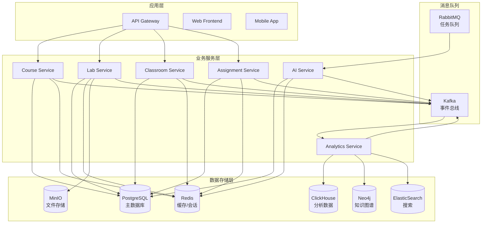
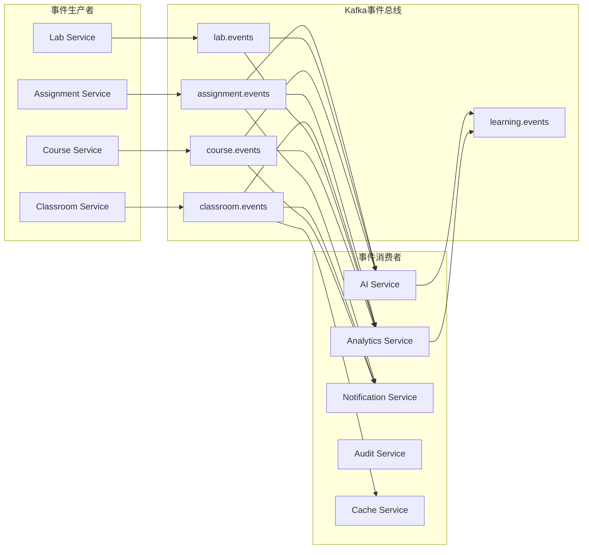
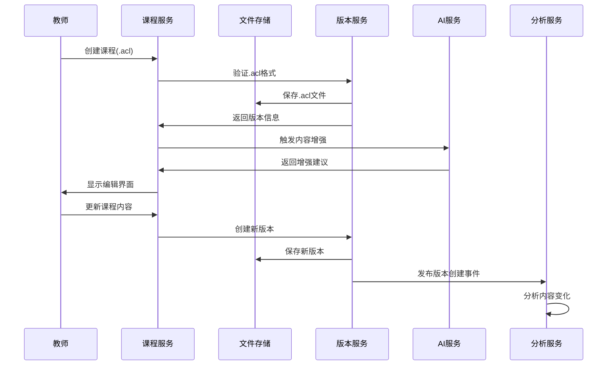
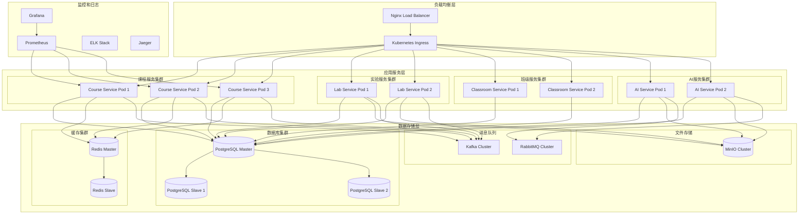

# 接口契约与系统架构设计

## API接口契约规范

### 1. RESTful API设计原则

#### 1.1 API版本控制
```typescript
// API版本策略
interface APIVersionStrategy {
  // URL路径版本控制
  pathBased: 'api/v1/courses',

  // Header版本控制 (未来扩展)
  headerBased: 'Accept: application/vnd.education.v1+json',

  // 向后兼容性保证
  backwardCompatibility: '至少支持2个主版本'
}
```

#### 1.2 统一响应格式
```typescript
// 标准API响应格式
interface APIResponse<T> {
  success: boolean;
  data?: T;
  error?: {
    code: string;
    message: string;
    details?: any;
    timestamp: string;
    traceId: string;
  };
  pagination?: {
    page: number;
    limit: number;
    total: number;
    totalPages: number;
  };
  metadata?: {
    requestId: string;
    version: string;
    processingTime: number;
  };
}

// 成功响应示例
{
  "success": true,
  "data": {
    "id": "course-123",
    "title": "光的折射与反射"
  },
  "metadata": {
    "requestId": "req-abc123",
    "version": "v1",
    "processingTime": 150
  }
}

// 错误响应示例
{
  "success": false,
  "error": {
    "code": "COURSE_NOT_FOUND",
    "message": "指定的课程不存在",
    "details": {
      "courseId": "invalid-id"
    },
    "timestamp": "2024-01-15T10:30:00Z",
    "traceId": "trace-xyz789"
  }
}
```

### 2. 核心服务接口契约

#### 2.1 课程管理服务 (Course Service)

```typescript
// 课程管理API接口
interface CourseServiceAPI {
  // 课程CRUD操作
  'POST /api/v1/courses': {
    request: CreateCourseRequest;
    response: APIResponse<Course>;
    description: '创建新课程';
    auth: ['teacher', 'admin'];
  };

  'GET /api/v1/courses': {
    request: {
      query?: {
        page?: number;
        limit?: number;
        subject?: string;
        grade?: string;
        search?: string;
        sortBy?: 'createdAt' | 'updatedAt' | 'title';
        sortOrder?: 'asc' | 'desc';
      };
    };
    response: APIResponse<Course[]>;
    description: '获取课程列表';
    auth: ['student', 'teacher', 'admin'];
  };

  'GET /api/v1/courses/{courseId}': {
    request: {
      params: { courseId: string };
    };
    response: APIResponse<Course>;
    description: '获取课程详情';
    auth: ['student', 'teacher', 'admin'];
  };

  'PUT /api/v1/courses/{courseId}': {
    request: {
      params: { courseId: string };
      body: UpdateCourseRequest;
    };
    response: APIResponse<Course>;
    description: '更新课程信息';
    auth: ['teacher', 'admin'];
  };

  // AI辅助功能
  'POST /api/v1/courses/{courseId}/ai-generate': {
    request: {
      params: { courseId: string };
      body: AIGenerationRequest;
    };
    response: APIResponse<AIGenerationResult>;
    description: 'AI生成课程内容';
    auth: ['teacher', 'admin'];
  };

  'POST /api/v1/courses/{courseId}/ai-enhance': {
    request: {
      params: { courseId: string };
      body: AIEnhancementRequest;
    };
    response: APIResponse<AIEnhancementResult>;
    description: 'AI增强课程内容';
    auth: ['teacher', 'admin'];
  };

  // 版本管理
  'GET /api/v1/courses/{courseId}/versions': {
    request: {
      params: { courseId: string };
    };
    response: APIResponse<CourseVersion[]>;
    description: '获取课程版本列表';
    auth: ['teacher', 'admin'];
  };

  'POST /api/v1/courses/{courseId}/versions': {
    request: {
      params: { courseId: string };
      body: CreateVersionRequest;
    };
    response: APIResponse<CourseVersion>;
    description: '创建课程新版本';
    auth: ['teacher', 'admin'];
  };
}

// 请求/响应类型定义
interface CreateCourseRequest {
  title: string;
  description: string;
  subject: string;
  grade: string;
  learningObjectives: LearningObjective[];
  targetAudience: TargetAudience;
  estimatedDuration: number;
  tags?: string[];
}

interface AIGenerationRequest {
  type: 'structure' | 'content' | 'activities' | 'assessment';
  targetNodes?: string[];
  context: {
    gradeLevel: string;
    learningStyle: string;
    difficulty: 'beginner' | 'intermediate' | 'advanced';
  };
  preferences?: {
    includeExperiments: boolean;
    includeInteractions: boolean;
    includeAssignments: boolean;
  };
}

interface Course {
  id: string;
  title: string;
  description: string;
  subject: string;
  grade: string;
  authorId: string;
  authorName: string;
  learningObjectives: LearningObjective[];
  structure: CourseStructure;
  version: string;
  status: 'draft' | 'published' | 'archived';
  createdAt: Date;
  updatedAt: Date;
  metadata: {
    totalDuration: number;
    nodeCount: number;
    aiGenerated: boolean;
    tags: string[];
  };
}
```

#### 2.2 实验管理服务 (Lab Service)

```typescript
interface LabServiceAPI {
  // 实验环境管理
  'POST /api/v1/labs/environments': {
    request: CreateEnvironmentRequest;
    response: APIResponse<LabEnvironment>;
    description: '创建实验环境';
    auth: ['student', 'teacher'];
  };

  'GET /api/v1/labs/environments/{environmentId}': {
    request: {
      params: { environmentId: string };
    };
    response: APIResponse<LabEnvironment>;
    description: '获取实验环境详情';
    auth: ['student', 'teacher'];
  };

  'DELETE /api/v1/labs/environments/{environmentId}': {
    request: {
      params: { environmentId: string };
    };
    response: APIResponse<null>;
    description: '销毁实验环境';
    auth: ['student', 'teacher'];
  };

  // 实验执行
  'POST /api/v1/labs/environments/{environmentId}/execute': {
    request: {
      params: { environmentId: string };
      body: {
        code: string;
        language: string;
      };
    };
    response: APIResponse<ExecutionResult>;
    description: '执行实验代码';
    auth: ['student'];
  };

  // AI实验助手
  'POST /api/v1/labs/{experimentId}/assist': {
    request: {
      params: { experimentId: string };
      body: LabAssistanceRequest;
    };
    response: APIResponse<LabAssistance>;
    description: '获取AI实验助手帮助';
    auth: ['student'];
  };

  // 实验模板管理
  'GET /api/v1/labs/templates': {
    request: {
      query?: {
        subject?: string;
        difficulty?: string;
        type?: string;
      };
    };
    response: APIResponse<ExperimentTemplate[]>;
    description: '获取实验模板列表';
    auth: ['teacher', 'student'];
  };
}

interface CreateEnvironmentRequest {
  studentId: string;
  experimentId: string;
  resourceRequirements: {
    cpu: string;
    memory: string;
    storage?: string;
    gpu?: boolean;
  };
  securityLevel: 'basic' | 'standard' | 'high';
}

interface LabEnvironment {
  id: string;
  studentId: string;
  experimentId: string;
  jupyterUrl: string;
  status: 'initializing' | 'ready' | 'running' | 'stopped' | 'error';
  resources: {
    allocated: ResourceAllocation;
    usage: ResourceUsage;
  };
  createdAt: Date;
  expiresAt: Date;
}
```

#### 2.3 班级管理服务 (Classroom Service)

```typescript
interface ClassroomServiceAPI {
  // 班级管理
  'POST /api/v1/classrooms': {
    request: CreateClassroomRequest;
    response: APIResponse<Classroom>;
    description: '创建班级';
    auth: ['teacher', 'admin'];
  };

  'GET /api/v1/classrooms/{classroomId}': {
    request: {
      params: { classroomId: string };
    };
    response: APIResponse<Classroom>;
    description: '获取班级详情';
    auth: ['teacher', 'admin'];
  };

  'POST /api/v1/classrooms/{classroomId}/students': {
    request: {
      params: { classroomId: string };
      body: { studentIds: string[] };
    };
    response: APIResponse<null>;
    description: '添加学生到班级';
    auth: ['teacher', 'admin'];
  };

  // 实时课堂
  'POST /api/v1/classrooms/{classroomId}/sessions': {
    request: {
      params: { classroomId: string };
      body: CreateSessionRequest;
    };
    response: APIResponse<ClassSession>;
    description: '开始课堂会话';
    auth: ['teacher'];
  };

  'GET /api/v1/classrooms/{classroomId}/sessions/{sessionId}/status': {
    request: {
      params: { classroomId: string; sessionId: string };
    };
    response: APIResponse<SessionStatus>;
    description: '获取课堂实时状态';
    auth: ['teacher', 'student'];
  };

  // WebSocket事件
  'ws://api/v1/classrooms/{classroomId}/sessions/{sessionId}/realtime': {
    events: {
      'student.join': StudentJoinEvent;
      'student.leave': StudentLeaveEvent;
      'student.status.update': StudentStatusUpdateEvent;
      'teacher.message': TeacherMessageEvent;
      'class.progress.update': ClassProgressUpdateEvent;
    };
    description: '实时课堂WebSocket连接';
    auth: ['teacher', 'student'];
  };
}
```

#### 2.4 作业管理服务 (Assignment Service)

```typescript
interface AssignmentServiceAPI {
  // 作业管理
  'POST /api/v1/assignments': {
    request: CreateAssignmentRequest;
    response: APIResponse<Assignment>;
    description: '创建作业';
    auth: ['teacher', 'admin'];
  };

  'POST /api/v1/assignments/{assignmentId}/submissions': {
    request: {
      params: { assignmentId: string };
      body: CreateSubmissionRequest;
    };
    response: APIResponse<Submission>;
    description: '提交作业';
    auth: ['student'];
  };

  'POST /api/v1/assignments/{assignmentId}/auto-grade': {
    request: {
      params: { assignmentId: string };
      body: AutoGradeRequest;
    };
    response: APIResponse<GradingResult>;
    description: 'AI自动批改作业';
    auth: ['teacher'];
  };

  // AI出题
  'POST /api/v1/assignments/generate': {
    request: GenerateAssignmentRequest;
    response: APIResponse<GeneratedAssignment>;
    description: 'AI生成作业题目';
    auth: ['teacher'];
  };
}
```

### 3. GraphQL接口设计

```typescript
// GraphQL Schema定义
const typeDefs = `
  type Query {
    # 课程查询
    course(id: ID!): Course
    courses(filter: CourseFilter, pagination: Pagination): CourseConnection

    # 实验查询
    experiment(id: ID!): Experiment
    experiments(filter: ExperimentFilter): [Experiment]

    # 学习分析
    studentProfile(studentId: ID!): StudentProfile
    classAnalytics(classroomId: ID!): ClassAnalytics
  }

  type Mutation {
    # 课程操作
    createCourse(input: CreateCourseInput!): Course!
    updateCourse(id: ID!, input: UpdateCourseInput!): Course!

    # AI辅助
    generateCourseContent(input: GenerateContentInput!): GenerationResult!
    enhanceCourseContent(id: ID!, input: EnhanceContentInput!): Course!

    # 实验操作
    createLabEnvironment(input: CreateLabEnvironmentInput!): LabEnvironment!
    executeExperiment(input: ExecuteExperimentInput!): ExecutionResult!
  }

  type Subscription {
    # 实时订阅
    classroomSessionUpdates(classroomId: ID!): ClassroomSession!
    studentProgressUpdates(studentId: ID!): StudentProgress!
    labEnvironmentStatus(environmentId: ID!): LabEnvironmentStatus!
  }

  # 核心类型定义
  type Course {
    id: ID!
    title: String!
    description: String
    subject: String!
    grade: String!
    author: User!
    structure: CourseStructure!
    versions: [CourseVersion!]!
    analytics: CourseAnalytics
    createdAt: DateTime!
    updatedAt: DateTime!
  }

  type Experiment {
    id: ID!
    title: String!
    description: String
    type: ExperimentType!
    subject: String!
    difficulty: DifficultyLevel!
    notebook: String!
    aiAssistant: LabAIAssistant
    estimatedTime: Int!
    prerequisites: [String!]
  }

  type StudentProfile {
    id: ID!
    user: User!
    knowledgeMastery: KnowledgeMastery!
    behaviorPatterns: BehaviorPatterns!
    learningProgress: LearningProgress!
    recommendations: [LearningRecommendation!]!
  }
`;
```

## 数据库拓扑设计

### 1. 数据库分布策略



### 2. 数据库Schema设计

#### 2.1 PostgreSQL 主数据库

```sql
-- 用户和认证
CREATE TABLE users (
    id UUID PRIMARY KEY DEFAULT gen_random_uuid(),
    tenant_id UUID NOT NULL,
    email VARCHAR(255) UNIQUE NOT NULL,
    username VARCHAR(100) UNIQUE NOT NULL,
    password_hash VARCHAR(255) NOT NULL,
    first_name VARCHAR(100),
    last_name VARCHAR(100),
    role user_role NOT NULL,
    status user_status DEFAULT 'active',
    profile JSONB,
    created_at TIMESTAMP WITH TIME ZONE DEFAULT NOW(),
    updated_at TIMESTAMP WITH TIME ZONE DEFAULT NOW()
);

CREATE TYPE user_role AS ENUM ('student', 'teacher', 'admin', 'parent');
CREATE TYPE user_status AS ENUM ('active', 'inactive', 'suspended');

-- 租户管理
CREATE TABLE tenants (
    id UUID PRIMARY KEY DEFAULT gen_random_uuid(),
    name VARCHAR(255) NOT NULL,
    domain VARCHAR(255) UNIQUE,
    plan tenant_plan DEFAULT 'basic',
    settings JSONB,
    created_at TIMESTAMP WITH TIME ZONE DEFAULT NOW(),
    updated_at TIMESTAMP WITH TIME ZONE DEFAULT NOW()
);

CREATE TYPE tenant_plan AS ENUM ('basic', 'professional', 'enterprise');

-- 课程管理
CREATE TABLE courses (
    id UUID PRIMARY KEY DEFAULT gen_random_uuid(),
    tenant_id UUID NOT NULL REFERENCES tenants(id),
    author_id UUID NOT NULL REFERENCES users(id),
    title VARCHAR(255) NOT NULL,
    description TEXT,
    subject VARCHAR(100) NOT NULL,
    grade VARCHAR(50) NOT NULL,
    acl_content JSONB NOT NULL,
    current_version VARCHAR(50) DEFAULT '1.0.0',
    status course_status DEFAULT 'draft',
    metadata JSONB,
    created_at TIMESTAMP WITH TIME ZONE DEFAULT NOW(),
    updated_at TIMESTAMP WITH TIME ZONE DEFAULT NOW()
);

CREATE TYPE course_status AS ENUM ('draft', 'published', 'archived');

-- 课程版本管理
CREATE TABLE course_versions (
    id UUID PRIMARY KEY DEFAULT gen_random_uuid(),
    course_id UUID NOT NULL REFERENCES courses(id),
    version VARCHAR(50) NOT NULL,
    acl_content JSONB NOT NULL,
    commit_message TEXT,
    author_id UUID NOT NULL REFERENCES users(id),
    fingerprint VARCHAR(64),
    created_at TIMESTAMP WITH TIME ZONE DEFAULT NOW()
);

CREATE UNIQUE INDEX ON course_versions (course_id, version);

-- 班级管理
CREATE TABLE classrooms (
    id UUID PRIMARY KEY DEFAULT gen_random_uuid(),
    tenant_id UUID NOT NULL REFERENCES tenants(id),
    teacher_id UUID NOT NULL REFERENCES users(id),
    name VARCHAR(255) NOT NULL,
    description TEXT,
    grade VARCHAR(50),
    subject VARCHAR(100),
    settings JSONB,
    created_at TIMESTAMP WITH TIME ZONE DEFAULT NOW(),
    updated_at TIMESTAMP WITH TIME ZONE DEFAULT NOW()
);

-- 班级学生关联
CREATE TABLE classroom_students (
    id UUID PRIMARY KEY DEFAULT gen_random_uuid(),
    classroom_id UUID NOT NULL REFERENCES classrooms(id),
    student_id UUID NOT NULL REFERENCES users(id),
    enrolled_at TIMESTAMP WITH TIME ZONE DEFAULT NOW(),
    UNIQUE(classroom_id, student_id)
);

-- 实验管理
CREATE TABLE experiments (
    id UUID PRIMARY KEY DEFAULT gen_random_uuid(),
    tenant_id UUID NOT NULL REFERENCES tenants(id),
    title VARCHAR(255) NOT NULL,
    description TEXT,
    type experiment_type NOT NULL,
    subject VARCHAR(100) NOT NULL,
    difficulty difficulty_level NOT NULL,
    notebook_content JSONB NOT NULL,
    ai_config JSONB,
    estimated_time INTEGER, -- 分钟
    prerequisites TEXT[],
    created_at TIMESTAMP WITH TIME ZONE DEFAULT NOW(),
    updated_at TIMESTAMP WITH TIME ZONE DEFAULT NOW()
);

CREATE TYPE experiment_type AS ENUM ('jupyter', 'ai', 'file_upload');
CREATE TYPE difficulty_level AS ENUM ('beginner', 'intermediate', 'advanced');

-- 实验环境
CREATE TABLE lab_environments (
    id UUID PRIMARY KEY DEFAULT gen_random_uuid(),
    experiment_id UUID NOT NULL REFERENCES experiments(id),
    student_id UUID NOT NULL REFERENCES users(id),
    container_id VARCHAR(255),
    jupyter_url VARCHAR(500),
    status environment_status DEFAULT 'initializing',
    resources JSONB,
    security_level security_level DEFAULT 'standard',
    expires_at TIMESTAMP WITH TIME ZONE,
    created_at TIMESTAMP WITH TIME ZONE DEFAULT NOW()
);

CREATE TYPE environment_status AS ENUM ('initializing', 'ready', 'running', 'stopped', 'error');
CREATE TYPE security_level AS ENUM ('basic', 'standard', 'high');

-- 作业管理
CREATE TABLE assignments (
    id UUID PRIMARY KEY DEFAULT gen_random_uuid(),
    tenant_id UUID NOT NULL REFERENCES tenants(id),
    course_id UUID REFERENCES courses(id),
    classroom_id UUID REFERENCES classrooms(id),
    teacher_id UUID NOT NULL REFERENCES users(id),
    title VARCHAR(255) NOT NULL,
    description TEXT,
    type assignment_type NOT NULL,
    config JSONB NOT NULL,
    due_date TIMESTAMP WITH TIME ZONE,
    max_score DECIMAL(5,2),
    created_at TIMESTAMP WITH TIME ZONE DEFAULT NOW(),
    updated_at TIMESTAMP WITH TIME ZONE DEFAULT NOW()
);

CREATE TYPE assignment_type AS ENUM ('quiz', 'essay', 'experiment', 'project');

-- 作业提交
CREATE TABLE submissions (
    id UUID PRIMARY KEY DEFAULT gen_random_uuid(),
    assignment_id UUID NOT NULL REFERENCES assignments(id),
    student_id UUID NOT NULL REFERENCES users(id),
    content JSONB NOT NULL,
    files JSONB,
    status submission_status DEFAULT 'submitted',
    score DECIMAL(5,2),
    feedback JSONB,
    ai_grading_result JSONB,
    submitted_at TIMESTAMP WITH TIME ZONE DEFAULT NOW(),
    graded_at TIMESTAMP WITH TIME ZONE,
    graded_by UUID REFERENCES users(id)
);

CREATE TYPE submission_status AS ENUM ('draft', 'submitted', 'graded', 'returned');

-- AI操作记录
CREATE TABLE ai_operations (
    id UUID PRIMARY KEY DEFAULT gen_random_uuid(),
    user_id UUID NOT NULL REFERENCES users(id),
    operation_type operation_type NOT NULL,
    model_name VARCHAR(100),
    prompt_template VARCHAR(255),
    prompt_variables JSONB,
    input_data JSONB,
    output_data JSONB,
    quality_score DECIMAL(3,2),
    metadata JSONB,
    created_at TIMESTAMP WITH TIME ZONE DEFAULT NOW()
);

CREATE TYPE operation_type AS ENUM (
    'course_generation', 'content_enhancement', 'experiment_assistance',
    'assignment_generation', 'auto_grading', 'learning_analysis'
);
```

#### 2.2 Redis缓存设计

```typescript
// Redis缓存键设计规范
interface RedisKeyPatterns {
  // 用户会话
  userSession: `session:${userId}:${sessionId}`;

  // 课程缓存
  courseDetail: `course:${courseId}`;
  courseStructure: `course:${courseId}:structure`;
  courseList: `courses:${tenantId}:${page}`;

  // 实时课堂状态
  classroomStatus: `classroom:${classroomId}:status`;
  sessionStatus: `session:${sessionId}:status`;
  studentStatus: `student:${studentId}:status`;

  // 实验环境
  labEnvironment: `lab:${environmentId}`;
  studentLabs: `student:${studentId}:labs`;

  // AI响应缓存
  aiResponse: `ai:${hash}`;
  promptTemplate: `prompt:${templateName}:${version}`;

  // 权限缓存
  userPermissions: `permissions:${userId}:${tenantId}`;
  rolePermissions: `role:${roleId}`;
}

// 缓存策略配置
interface CacheStrategies {
  userSession: { ttl: 3600 }; // 1小时
  courseDetail: { ttl: 1800 }; // 30分钟
  courseStructure: { ttl: 1800 };
  classroomStatus: { ttl: 300 }; // 5分钟 (实时性要求高)
  labEnvironment: { ttl: 7200 }; // 2小时
  aiResponse: { ttl: 86400 }; // 24小时 (根据质量动态调整)
}
```

#### 2.3 ClickHouse分析数据库

```sql
-- 学习行为事件表
CREATE TABLE learning_events (
    event_id UUID,
    user_id UUID,
    tenant_id UUID,
    session_id UUID,
    event_type String,
    event_data JSON,
    timestamp DateTime,
    date Date MATERIALIZED toDate(timestamp),
    -- 分区键
    tenant_id,
    date
) ENGINE = MergeTree()
PARTITION BY (tenant_id, date)
ORDER BY (user_id, timestamp, event_type)
TTL timestamp + INTERVAL 1 YEAR;

-- 实验执行事件表
CREATE TABLE experiment_events (
    event_id UUID,
    student_id UUID,
    experiment_id UUID,
    environment_id UUID,
    event_type String, -- 'start', 'execute', 'error', 'complete'
    execution_data JSON,
    performance_metrics JSON,
    timestamp DateTime,
    date Date MATERIALIZED toDate(timestamp)
) ENGINE = MergeTree()
PARTITION BY (date)
ORDER BY (student_id, experiment_id, timestamp)
TTL timestamp + INTERVAL 6 MONTH;

-- 系统性能指标表
CREATE TABLE system_metrics (
    metric_name String,
    service_name String,
    metric_value Float64,
    labels JSON,
    timestamp DateTime
) ENGINE = MergeTree()
PARTITION BY toYYYYMM(timestamp)
ORDER BY (service_name, metric_name, timestamp)
TTL timestamp + INTERVAL 3 MONTH;
```

#### 2.4 Neo4j知识图谱

```cypher
// 知识概念节点
CREATE (concept:Concept {
  id: 'concept-refraction-law',
  name: '斯涅尔定律',
  subject: 'physics',
  difficulty: 'intermediate',
  description: '描述光在不同介质间传播规律的物理定律'
});

// 学习目标节点
CREATE (objective:LearningObjective {
  id: 'lo-001',
  description: '理解并应用斯涅尔定律解决实际问题',
  cognitiveLevel: 'application'
});

// 前置知识关系
CREATE (concept1:Concept {id: 'concept-light-properties'})-[:PREREQUISITE]->(concept2:Concept {id: 'concept-refraction-law'});

// 概念与学习目标关系
CREATE (concept)-[:SUPPORTS]->(objective);

// 学生掌握度关系
CREATE (student:Student {id: 'student-123'})-[:MASTERS {
  level: 0.8,
  lastAssessed: datetime(),
  assessmentType: 'quiz'
}]->(concept);

// 查询学生的知识盲点
MATCH (student:Student {id: 'student-123'})-[:MASTERS]->(concept:Concept)
WHERE concept.masteryLevel < 0.6
RETURN concept.name, concept.masteryLevel
ORDER BY concept.masteryLevel ASC;
```

## 消息流拓扑设计

### 1. 事件驱动架构



### 2. 事件定义

#### 2.1 课程事件

```typescript
// 课程相关事件定义
interface CourseEvents {
  'course.created': {
    eventId: string;
    eventType: 'course.created';
    payload: {
      courseId: string;
      authorId: string;
      tenantId: string;
      title: string;
      subject: string;
      grade: string;
    };
    timestamp: Date;
    metadata: {
      version: '1.0';
      source: 'course-service';
    };
  };

  'course.updated': {
    eventId: string;
    eventType: 'course.updated';
    payload: {
      courseId: string;
      changes: Record<string, any>;
      updatedBy: string;
    };
    timestamp: Date;
  };

  'course.published': {
    eventId: string;
    eventType: 'course.published';
    payload: {
      courseId: string;
      publishedBy: string;
      version: string;
    };
    timestamp: Date;
  };

  'course.version.created': {
    eventId: string;
    eventType: 'course.version.created';
    payload: {
      courseId: string;
      versionId: string;
      version: string;
      authorId: string;
      commitMessage: string;
    };
    timestamp: Date;
  };
}
```

#### 2.2 实验事件

```typescript
interface LabEvents {
  'experiment.started': {
    eventId: string;
    eventType: 'experiment.started';
    payload: {
      experimentId: string;
      studentId: string;
      environmentId: string;
      startTime: Date;
    };
    timestamp: Date;
  };

  'experiment.code.executed': {
    eventId: string;
    eventType: 'experiment.code.executed';
    payload: {
      experimentId: string;
      studentId: string;
      environmentId: string;
      code: string;
      language: string;
      executionTime: number;
      result: any;
      error?: string;
    };
    timestamp: Date;
  };

  'experiment.completed': {
    eventId: string;
    eventType: 'experiment.completed';
    payload: {
      experimentId: string;
      studentId: string;
      environmentId: string;
      duration: number;
      success: boolean;
      finalResults: any;
    };
    timestamp: Date;
  };

  'lab.assistance.requested': {
    eventId: string;
    eventType: 'lab.assistance.requested';
    payload: {
      studentId: string;
      experimentId: string;
      question: string;
      context: any;
    };
    timestamp: Date;
  };
}
```

#### 2.3 学习分析事件

```typescript
interface LearningEvents {
  'learning.progress.updated': {
    eventId: string;
    eventType: 'learning.progress.updated';
    payload: {
      studentId: string;
      courseId: string;
      nodeId: string;
      progress: number;
      timeSpent: number;
      completionStatus: 'in_progress' | 'completed' | 'skipped';
    };
    timestamp: Date;
  };

  'concept.mastery.assessed': {
    eventId: string;
    eventType: 'concept.mastery.assessed';
    payload: {
      studentId: string;
      conceptId: string;
      masteryLevel: number;
      assessmentType: 'quiz' | 'experiment' | 'assignment';
      confidence: number;
    };
    timestamp: Date;
  };

  'ai.recommendation.generated': {
    eventId: string;
    eventType: 'ai.recommendation.generated';
    payload: {
      studentId: string;
      recommendationType: 'content' | 'learning_path' | 'remediation';
      recommendations: any[];
      confidence: number;
      modelVersion: string;
    };
    timestamp: Date;
  };
}
```

### 3. 任务队列设计

```typescript
// RabbitMQ任务队列配置
interface TaskQueues {
  // AI处理队列
  'ai.content-generation': {
    routingKey: 'ai.content.generate';
    priority: 5;
    retryPolicy: { maxRetries: 3; backoff: 'exponential' };
  };

  'ai.auto-grading': {
    routingKey: 'ai.grading.process';
    priority: 3;
    retryPolicy: { maxRetries: 2; backoff: 'fixed' };
  };

  // 数据处理队列
  'analytics.batch-processing': {
    routingKey: 'analytics.batch.process';
    priority: 2;
    retryPolicy: { maxRetries: 1; backoff: 'linear' };
  };

  // 通知队列
  'notifications.email': {
    routingKey: 'notification.email.send';
    priority: 1;
    retryPolicy: { maxRetries: 5; backoff: 'exponential' };
  };

  'notifications.push': {
    routingKey: 'notification.push.send';
    priority: 4;
    retryPolicy: { maxRetries: 3; backoff: 'exponential' };
  };
}

// 任务定义示例
interface ContentGenerationTask {
  taskId: string;
  type: 'course-content' | 'experiment-assistance' | 'assignment-generation';
  payload: {
    userId: string;
    context: any;
    template: string;
    parameters: any;
  };
  priority: number;
  createdAt: Date;
  scheduledAt?: Date;
}
```

## .acl模型与各服务关系

### 1. .acl文件的生命周期管理



### 2. 服务间的.acl数据流

```typescript
// .acl文件在各服务间的流转
interface ACLDataFlow {
  // 1. 课程服务 - 主要管理者
  CourseService: {
    responsibilities: [
      'acl文件的CRUD操作',
      '版本管理和控制',
      '权限验证',
      '内容发布管理'
    ];
    dataFlow: {
      input: '用户编辑请求';
      output: '完整的acl文件';
      storage: 'PostgreSQL + MinIO';
    };
  };

  // 2. AI服务 - 内容生成和增强
  AIService: {
    responsibilities: [
      '基于上下文生成acl内容',
      '内容质量检查',
      '智能推荐增强',
      '自动化内容优化'
    ];
    dataFlow: {
      input: '课程目标、学生画像、教学上下文';
      output: '增强的acl节点内容';
      storage: 'Redis缓存 + PostgreSQL记录';
    };
  };

  // 3. 实验服务 - 实验配置提取
  LabService: {
    responsibilities: [
      '从acl中提取实验配置',
      '创建对应的实验环境',
      '实验数据收集和反馈'
    ];
    dataFlow: {
      input: 'acl文件中的实验节点';
      output: '实验环境和配置';
      storage: 'PostgreSQL + 容器运行时';
    };
  };

  // 4. 班级服务 - 课程内容分发
  ClassroomService: {
    responsibilities: [
      '向班级分发课程内容',
      '跟踪学生进度',
      '课堂状态管理'
    ];
    dataFlow: {
      input: '发布的acl课程';
      output: '学生可见的课程内容';
      storage: 'Redis实时状态 + PostgreSQL持久化';
    };
  };

  // 5. 分析服务 - 学习数据分析
  AnalyticsService: {
    responsibilities: [
      '解析acl结构用于分析',
      '学习路径追踪',
      '效果评估和推荐'
    ];
    dataFlow: {
      input: 'acl结构 + 学习行为数据';
      output: '学习洞察和推荐';
      storage: 'ClickHouse + Neo4j';
    };
  };
}
```

### 3. .acl文件的服务接口

```typescript
// .acl文件管理的统一接口
interface ACLFileService {
  // 文件操作
  createACL(content: AiCourseLayout, metadata: FileMetadata): Promise<ACLFile>;
  updateACL(fileId: string, updates: Partial<AiCourseLayout>): Promise<ACLFile>;
  getACL(fileId: string, version?: string): Promise<AiCourseLayout>;
  deleteACL(fileId: string): Promise<void>;

  // 版本管理
  createVersion(fileId: string, content: AiCourseLayout, message: string): Promise<ACLVersion>;
  getVersionHistory(fileId: string): Promise<ACLVersion[]>;
  rollbackToVersion(fileId: string, version: string): Promise<ACLFile>;
  compareVersions(fileId: string, version1: string, version2: string): Promise<ACLDiff>;

  // 内容处理
  validateACL(content: AiCourseLayout): Promise<ValidationResult>;
  extractResources(content: AiCourseLayout): Promise<ResourceReference[]>;
  renderToFormat(content: AiCourseLayout, format: 'markdown' | 'html' | 'pdf'): Promise<string>;

  // AI集成
  generateContent(template: string, context: GenerationContext): Promise<ACLNode>;
  enhanceContent(nodeId: string, enhancement: EnhancementRequest): Promise<ACLNode>;
  analyzeContent(content: AiCourseLayout): Promise<ContentAnalysis>;
}

// 各服务对ACL服务的依赖
interface ServiceDependencies {
  CourseService: {
    uses: ['ACLFileService', 'ValidationService'];
    operations: ['createACL', 'updateACL', 'validateACL'];
  };

  AIService: {
    uses: ['ACLFileService', 'ContentAnalysisService'];
    operations: ['getACL', 'generateContent', 'enhanceContent', 'analyzeContent'];
  };

  LabService: {
    uses: ['ACLFileService', 'ResourceExtractionService'];
    operations: ['getACL', 'extractResources'];
  };

  ClassroomService: {
    uses: ['ACLFileService', 'ContentRenderingService'];
    operations: ['getACL', 'renderToFormat'];
  };

  AnalyticsService: {
    uses: ['ACLFileService', 'ContentAnalysisService'];
    operations: ['getACL', 'analyzeContent', 'extractResources'];
  };
}
```

## 部署架构图

### 1. 容器化部署架构



### 2. Kubernetes部署配置

```yaml
# namespace配置
apiVersion: v1
kind: Namespace
metadata:
  name: education-platform
---
# 课程服务部署
apiVersion: apps/v1
kind: Deployment
metadata:
  name: course-service
  namespace: education-platform
spec:
  replicas: 3
  selector:
    matchLabels:
      app: course-service
  template:
    metadata:
      labels:
        app: course-service
    spec:
      containers:
      - name: course-service
        image: education-platform/course-service:v1.0.0
        ports:
        - containerPort: 3000
        env:
        - name: DATABASE_URL
          valueFrom:
            secretKeyRef:
              name: database-secret
              key: url
        - name: REDIS_URL
          valueFrom:
            secretKeyRef:
              name: redis-secret
              key: url
        - name: KAFKA_BROKERS
          value: "kafka-service:9092"
        resources:
          requests:
            memory: "256Mi"
            cpu: "250m"
          limits:
            memory: "512Mi"
            cpu: "500m"
        livenessProbe:
          httpGet:
            path: /health
            port: 3000
          initialDelaySeconds: 30
          periodSeconds: 10
        readinessProbe:
          httpGet:
            path: /ready
            port: 3000
          initialDelaySeconds: 5
          periodSeconds: 5
---
# 课程服务服务
apiVersion: v1
kind: Service
metadata:
  name: course-service
  namespace: education-platform
spec:
  selector:
    app: course-service
  ports:
  - port: 80
    targetPort: 3000
  type: ClusterIP
---
# 自动扩缩容配置
apiVersion: autoscaling/v2
kind: HorizontalPodAutoscaler
metadata:
  name: course-service-hpa
  namespace: education-platform
spec:
  scaleTargetRef:
    apiVersion: apps/v1
    kind: Deployment
    name: course-service
  minReplicas: 3
  maxReplicas: 10
  metrics:
  - type: Resource
    resource:
      name: cpu
      target:
        type: Utilization
        averageUtilization: 70
  - type: Resource
    resource:
      name: memory
      target:
        type: Utilization
        averageUtilization: 80
```

### 3. CI/CD流水线

```yaml
# GitHub Actions工作流
name: Education Platform CI/CD

on:
  push:
    branches: [main, develop]
  pull_request:
    branches: [main]

env:
  REGISTRY: ghcr.io
  IMAGE_NAME: ${{ github.repository }}

jobs:
  test:
    runs-on: ubuntu-latest
    strategy:
      matrix:
        service: [course-service, lab-service, classroom-service, ai-service]

    steps:
    - uses: actions/checkout@v3

    - name: Setup Node.js
      uses: actions/setup-node@v3
      with:
        node-version: '18'
        cache: 'npm'

    - name: Install dependencies
      run: |
        cd services/${{ matrix.service }}
        npm ci

    - name: Run tests
      run: |
        cd services/${{ matrix.service }}
        npm run test

    - name: Run integration tests
      run: |
        cd services/${{ matrix.service }}
        npm run test:integration

    - name: Upload coverage reports
      uses: codecov/codecov-action@v3

  build:
    needs: test
    runs-on: ubuntu-latest
    if: github.ref == 'refs/heads/main'

    strategy:
      matrix:
        service: [course-service, lab-service, classroom-service, ai-service]

    steps:
    - uses: actions/checkout@v3

    - name: Log in to Container Registry
      uses: docker/login-action@v2
      with:
        registry: ${{ env.REGISTRY }}
        username: ${{ github.actor }}
        password: ${{ secrets.GITHUB_TOKEN }}

    - name: Extract metadata
      id: meta
      uses: docker/metadata-action@v4
      with:
        images: ${{ env.REGISTRY }}/${{ env.IMAGE_NAME }}/${{ matrix.service }}
        tags: |
          type=ref,event=branch
          type=ref,event=pr
          type=sha,prefix={{branch}}-

    - name: Build and push Docker image
      uses: docker/build-push-action@v4
      with:
        context: ./services/${{ matrix.service }}
        push: true
        tags: ${{ steps.meta.outputs.tags }}
        labels: ${{ steps.meta.outputs.labels }}

  deploy:
    needs: build
    runs-on: ubuntu-latest
    if: github.ref == 'refs/heads/main'
    environment: production

    steps:
    - uses: actions/checkout@v3

    - name: Setup kubectl
      uses: azure/setup-kubectl@v3
      with:
        version: 'v1.24.0'

    - name: Configure kubectl
      run: |
        echo "${{ secrets.KUBE_CONFIG }}" | base64 -d > kubeconfig
        export KUBECONFIG=kubeconfig

    - name: Deploy to Kubernetes
      run: |
        kubectl apply -f k8s/
        kubectl rollout status deployment/course-service
        kubectl rollout status deployment/lab-service
        kubectl rollout status deployment/classroom-service
        kubectl rollout status deployment/ai-service
```

这个接口契约与系统架构设计完整地定义了：

1. **API接口契约**: RESTful API和GraphQL的完整规范
2. **数据库拓扑**: 多数据库策略的详细设计
3. **消息流架构**: 事件驱动和任务队列的完整设计
4. **.acl模型关系**: 各服务如何处理和流转.acl文件
5. **部署架构**: 容器化部署和CI/CD流水线

为整个智能教育基础设施提供了坚实的技术基础。